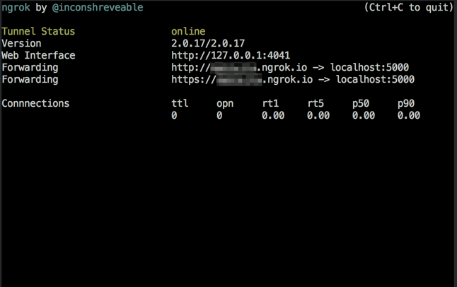
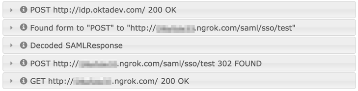

# Introduction

This is an example SAML SP service written using [Flask](http://flask.pocoo.org/) and [pysaml2](https://github.com/rohe/pysaml2).

# Requirements

-   [Python](https://www.python.org/) 2.7+
-   [Virtualenv](https://virtualenv.pypa.io/en/latest/)
-   [pip](https://pip.pypa.io/en/stable/)

You will also need a development environment capable of compiling
Python packages and the "libffi" and "libxmlsec1" development
libraries, which are needed by PySAML2.

Instructions for installing these development libraries will differ
depending on your host operating system.

## Mac OS X

```shell
$ brew install libffi libxmlsec1
```

## RHEL

```shell
$ sudo yum install libffi-devel xmlsec1 xmlsec1-openssl
```

# Installation

```shell
$ virtualenv venv
$ source venv/bin/activate
$ pip install -r requirements.txt 
```

# Running

 ```shell
$ python app.py 
 ```

# Testing

The fastest way to test this example SAML SP is to use the [saml.oktadev.com](http://saml.oktadev.com/) service.

Here is how:

1.  Edit the "app.py" file and uncomment the line in the "test" line in "metadata\_url\_for" dictionary.
    
    ```shell
    $ $EDITOR app.py
    ```
    
    Change this line:
    
    ```shell
    # 'test': 'http://idp.oktadev.com/metadata',                                                                                                
    ```
    
    To this:
    
    ```shell
    'test': 'http://idp.oktadev.com/metadata',
    ```
2.  Start the example SAML SP
    
    ```shell
    $ python app.py
    ```
3.  Start ngrok on the port that the example SAML SP is running on. By default, the example SAML SP runs on TCP 5000.
    
    ```shell
    $ ngrok http 5000
    ```
    
    You will need to [install ngrok](https://ngrok.com/download) if you haven't already.
    
    Here is what it should look like:
    
    
4.  Run [saml.oktadev.com](http://saml.oktadev.com) to test this example SAML SP
    -   Load [saml.oktadev.com](http://saml.oktadev.com) in your browser and fill out as follows:
        
        **Issuer:** "urn:example:idp"
        
        **SAML ACS URL:** "<http://REPLACE_ME.ngrok.com/saml/sso/test>"
        
        **SAML Audience URI:** "<http://REPLACE_ME.ngrok.com/saml/sso/test>"
        
        Be sure to replace the string "REPLACE\_ME" with the sub-domain that ngrok selected for you!
    -   Click the "Submit" button.
    -   Your output should look like the image below:
        

# Testing the security of your SAML SP

After successfully completing the steps in the "Testing" section
above, select the "Run security validation" option to have
saml.oktadev.com run an extended series of security tests against
your SAML SP.

# Contact

Updates or corrections to this document are very welcome. Feel free
to send [pull requests](https://help.github.com/articles/using-pull-requests/) with suggestions.


Additionally, comments or questions can be sent to:
&#x64;&#x65;&#x76;&#x65;&#x6C;&#x6F;&#x70;&#x65;&#x72;&#x73;&#x40;&#x6F;&#x6B;&#x74;&#x61;&#x2E;&#x63;&#x6F;&#x6D;